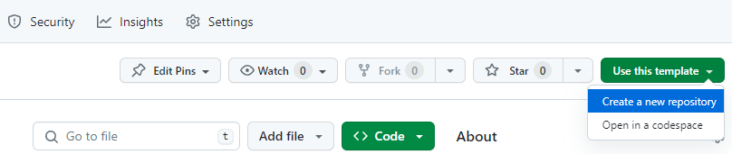
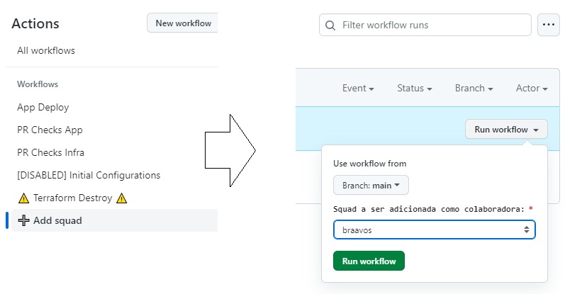

# node-ecs-template

## Como utilizar esse template

No lado direito superior do repositório, selecionar "Use this template" > "Create a new repository":



> [!CAUTION]
> Ao escolher o nome do novo repositório, ter em mente que ele **NÃO poderá ser modificado depois**. Sugere-se o padrão `<país>-<aplicação>-<serviço>` (p. ex. `br-order-service`).

## Configurando permissão de write para a squad

Para permitir que membros da squad interajam com o novo repositório é preciso adicionar a squad com permissão de _write_ primeiro. Na aba de Actions do novo repositório, procure o workflow "Add squad" à esquerda. Depois de clicar nele, selecione a opção "Run workflow" à direita, escolha a squad para ser adicionada, e clique em "Run workflow".



Sendo necessário adicionar mais de uma squad, basta repetir essa operação outras vezes.

## Configuração inicial do repositório

Após a criação do novo repositório e adição da squad, a **primeira PR** deverá ser aberta contendo as seguintes **modificações obrigatórias**:

### 1) Atualização (se necessária) da versão Node

Verifique se o arquivo .nvmrc contém a versão Node que será utilizada pelo microsserviço. Se não, atualize a versão nessa PR inicial.

> [!IMPORTANT]
> Esse arquivo deve permanecer na **raiz** do repositório. Caso seja necessário, adicione um arquivo igual dentro de src, mas não remova o .nvmrc da raiz.

### 2) Configurações do microsserviço

Na PR inicial, no arquivo `./terraform/main.tf`, as seguintes linhas devem ser preenchidas:

```tf
serviceName        = ""
ingressContextPath = ""
```

#### 2.1) serviceName

Nome único identificador do microsserviço. P. ex.: `serviceName = "br-order-service"`

#### 2.2) ingressContextPath

Rota contexto de entrada para as requisições do microsserviço. P. ex.: `ingressContextPath = "/order*"`

> [!IMPORTANT]
> Deve obrigatoriamente conter / no início e um **asterisco ao final**.

### 3) Atualização do arquivo CODEOWNERS

Na **primeira PR**, também adicione a(s) squad(s) que deve(m) ter acesso como CODEOWNERS no repositório.

Após essas modificações, a PR deverá ser aberta, e após a finalização dos PR checks, poderá ser mergeada. Se tudo foi configurado corretamente, o primeiro deployment de infraestrutura (arquivos `./terraform/**`) e aplicação (arquivo `./src/index.js`) em ambiente de DEV deverá ocorrer de forma automática e sem erros.

## Atualizando o código do microsserviço

Essa etapa deve ser realizada em uma **segunda** PR, separada da PR inicial de configuração, a fim de permitir a diferenciação entre problemas no código e na infraestrutura, caso ocorra alguma falha.

### 1) Adaptação do código-fonte

Realizar a adaptação do código-fonte, conforme a necessidade da squad, se baseando no [template de microsserviço](https://github.com/LatamNutrien/template-microservice) disponibilizado pelo time de arquitetura.

### 2) Alteração da rota do Health check

Alterar a rota implementada para o health check do microsserviço. Ex.: `healthPath = "/health"`

No arquivo `./terraform/main.tf`, a seguinte linha deve ser preenchida:

```tf
healthPath         = ""
```

> [!IMPORTANT]
> Deve obrigatoriamente conter / no início.

### 3) Permissões adicionais do microsserviço

> [!IMPORTANT]
> Alteração adicional necessária **APENAS SE** o novo microsserviço vai buscar suas variáveis de ambiente no `Secrets Manager`.

Necessário sinalizar que o novo microsserviço precisa de permissão ao `Secrets Manager`. Ex.:

No arquivo `./terraform/main.tf`, a seguinte linha deve ser alterada:

```tf
add_secretsmanager_permissions = true
```

Caso o novo microsserviço vá fazer retrieve das variáveis no modelo convencional (`Parameter Store`), deixar com o valor default `false`.

### 4) GraphQL e Apollo Server

> [!IMPORTANT]
> Alterações adicionais necessárias **APENAS SE** o novo microsserviço utilizar **GraphQL/Apollo**:

### 4.1) Variáveis específicas do Apollo

No arquivo `./github/workflows/on-pull-request-app.yml`, as seguintes linhas no início devem ser preenchidas:

```yml
env:
  APOLLO_SERVICE_NAME: "" # preencher
  SCHEMA_FILE: "" # preencher
```

#### APOLLO_SERVICE_NAME

Nome do microsserviço no Apollo Server. P. ex.: `APOLLO_SERVICE_NAME: "br-order-service"`.

#### SCHEMA_FILE

Caminho completo do arquivo .graphql gerado após a execução do comando `yarn build`. P. ex.: `SCHEMA_FILE: "./dist/infrastructure/generated/schema.graphql"`.

### 4.2) Adaptação do endpoint de health check

O Apollo Graphql disponibiliza um endpoint de health check genérico. Portanto, se o serviço não possuir um endpoint específico implementado, pode-se utilizar desse endpoint.

No arquivo `./terraform/main.tf`, a seguinte linha deve ser preenchida:

```tf
healthPath         = "/.well-known/apollo/server-health"
```

## Configuração de variáveis de ambiente

É necessário solicitar para o time de Cloud/DevOps a configuração das variáveis de ambiente do novo microsserviço. Basta seguir o procedimento comum: abrir um ticket na board CEB e avisar no canal do Slack #devops-public.

> [!IMPORTANT]
> Sinalizar se as variáveis do microsserviço devem ser configuradas usando `Secrets Manager` ou `Parameter Store`. Isso tem relação direta com o passo **3**.
